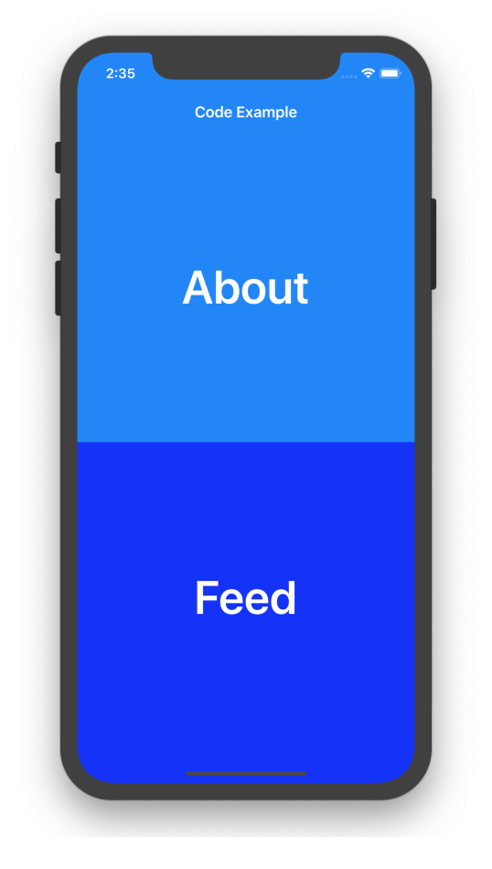
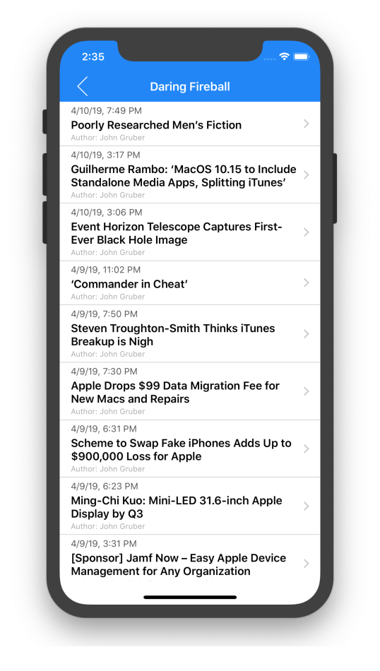
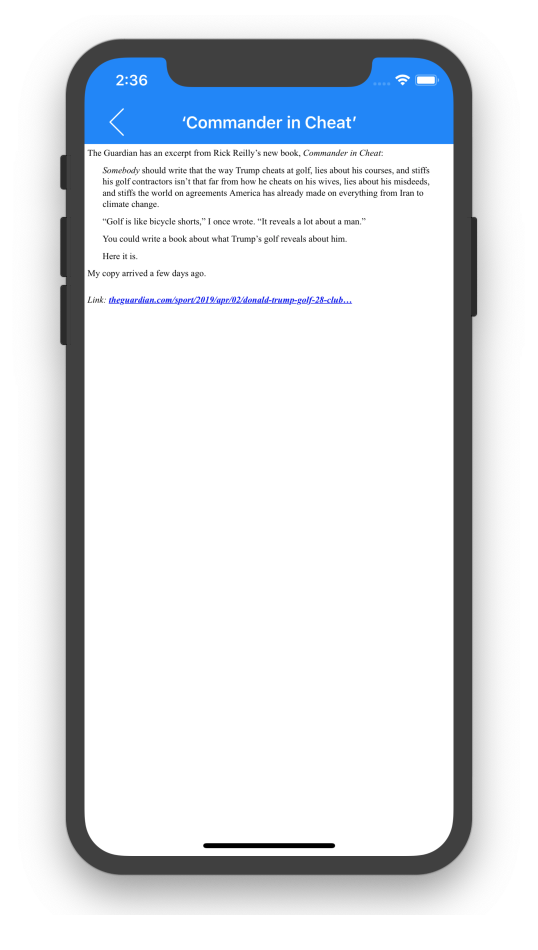
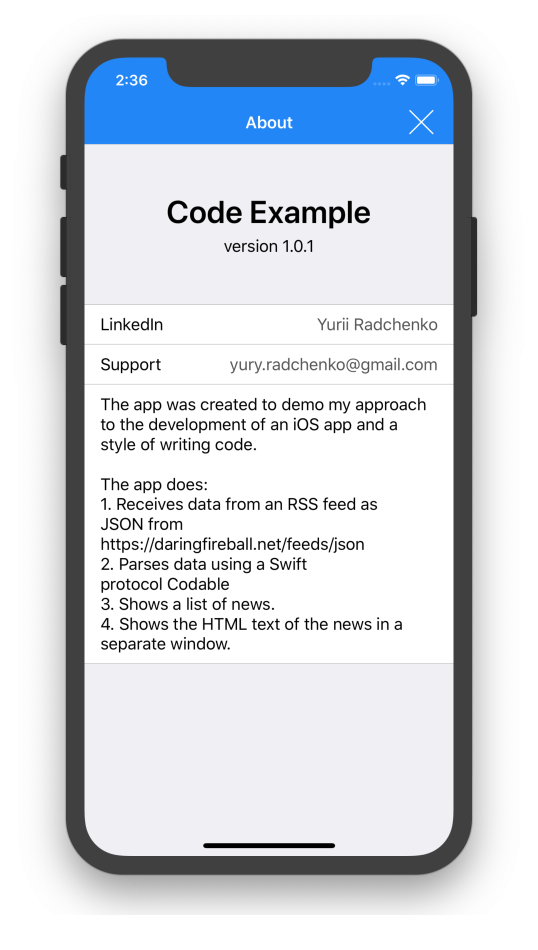

# Code Example

## About app
The app was created to demo my approach to the development of an iOS app and a style of writing code.
            
The app does:
1. Receives data from an RSS feed as JSON from https://daringfireball.net/feeds/json
2. Parses data using a Swift protocol Codable.
3. Shows a list of news.
4. Shows the HTML text of the news in a separate window.

## Screenshots

